# TrustFusion-GNN Data Flow Diagram

This file documents the current end-to-end data path between ESP32 nodes, the Raspberry Pi gateway, and the TrustFusion-GNN cloud side.

## Diagram

```mermaid
flowchart LR
    A[ESP32 Sensor Nodes\nTemperature / Humidity / Soil / Light\nPublish frequency: not defined in this repo] -->|MQTT JSON\nFrequency = same as ESP32 publish rate| B[MQTT Broker]
    B --> C[Raspberry Pi MQTT Handler\nReceive and parse immediately\nEvent-driven, no polling interval]
    C --> D[Data Processor\nValidate / clean / score quality\nRuns once per received message]
    D --> E[Edge Anomaly Detector\nRuns once per valid reading\nUses 20-point history window]
    E --> F[Local SQLite Storage\nWrite immediately after processing]
    E --> G[Cloud Upload Queue\nAppend immediately after processing]
    G -->|HTTP REST batch upload\nEvery 30 seconds\nUp to 50 records per batch| H[Cloud API Layer\nNot implemented yet]

    subgraph Cloud[trustfusion_gnn Cloud Logic]
        H --> I[Real-data ingestion\nNeeded for Pi uploads]
        I --> J[Window builder + sensor mapping\nNeeded to align data to 7 sensors]
        J --> K[Training dataset builder\nNeeded to construct labels]
        K --> L[Trainer]
        N[collected_data/\ntrain.npz / val.npz / test.npz] --> L
        L --> O[TrustFusion-GNN]
        O --> P[Metrics / Logs / Reports]
        O --> Q[Inference]
    end

    R[Cloud model config\nSampling rate: 1 Hz\nWindow size: 60 points\nEvaluation interval: 5 s] --> O

    classDef existing fill:#dff3e4,stroke:#2d6a4f,stroke-width:1.5px,color:#1b4332;
    classDef storage fill:#e0ecff,stroke:#3a86ff,stroke-width:1.5px,color:#1d3557;
    classDef missing fill:#fff3cd,stroke:#bc6c25,stroke-width:1.5px,color:#6c3b00;

    class A,B,C,D,E,G,L,O,P,Q,R existing;
    class F,N storage;
    class H,I,J,K missing;
```

## Frequency Summary

| Segment | Current frequency | Source |
|---|---:|---|
| ESP32 -> MQTT Broker | Unknown in this repo | Depends on ESP32 firmware; not defined in the Raspberry Pi or cloud repositories |
| MQTT Broker -> Raspberry Pi | Same as ESP32 publish rate | Event-driven subscription |
| Raspberry Pi parsing | Immediate, once per message | MQTT callback path |
| Raspberry Pi processing | Immediate, once per message | Data processor callback |
| Edge anomaly detection | Immediate, once per valid reading | Uses 20-point historical window |
| Local SQLite storage | Immediate, once per valid processed message | Written during callback flow |
| Cloud upload queue append | Immediate, once per valid processed message | Appended during callback flow |
| Raspberry Pi -> Cloud batch upload | Every 30 seconds | Configured `upload_interval` |
| Cloud upload batch size | Up to 50 records per batch | Configured uploader batch size |
| Cloud model sampling assumption | 1 Hz | TrustFusion-GNN config |
| Cloud model window size | 60 points | TrustFusion-GNN config |
| Cloud evaluation interval | Every 5 seconds | TrustFusion-GNN config |
| Model training | Manual / on-demand | Script-triggered (train.py) |
| Data-quality analysis | Manual / on-demand | Script-triggered |

## Practical Interpretation

If your ESP32 publishes at 1 Hz, then the timing becomes:

1. Raspberry Pi receives one new message every second.
2. The 20-point edge buffer represents about 20 seconds of recent history.
3. The TrustFusion-GNN 60-point model window represents about 60 seconds of history.
4. The cloud uploader sends one HTTP batch approximately every 30 seconds.

If the ESP32 publish rate is not 1 Hz, then the Pi side still works, but the cloud-side GNN timing assumptions no longer match exactly and a resampling or alignment layer is needed.